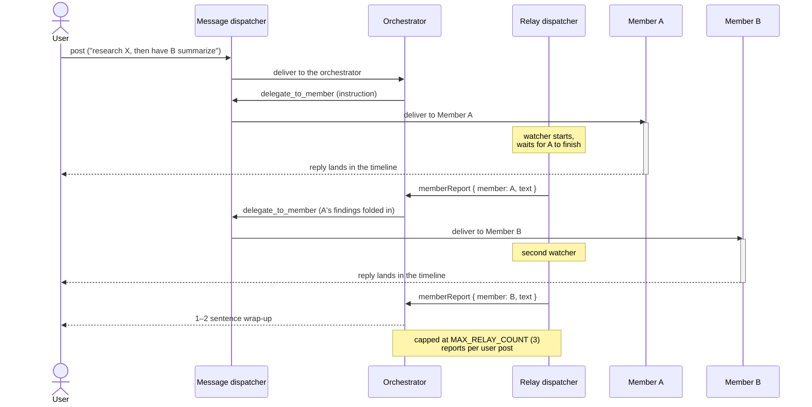

# open-agents-platform

An open-source agent management platform: create your own AI agents, invite
them into Discord-like channels, and let an orchestrator coordinate them as a
team that finishes real work — your own organization of cooperating agents.

## Demo

Creating an agent, opening a channel with a goal, and watching the
orchestrator hand work to the right members — research first, then copy:

https://github.com/user-attachments/assets/ec974493-ec2a-4424-9665-35eed20868e9

## Features

- **Agents from a form, not code** — an agent is a name, an optional role, and
  free-form instructions, stored in the DB and editable any time. Edits apply
  to live conversations from the next message.
- **Channels as the unit of work** — a channel has a name, an optional goal,
  and one or more invited agents. One member = a 1:1 chat; several members = a
  team working toward the goal.
- **An orchestrator that coordinates** — multi-agent channels automatically
  include the orchestrator. It reads your post, answers coordination itself,
  and delegates concrete work to the fitting member with its
  `delegate_to_member` tool.
- **Replies land directly in one timeline** — every member's conversation is
  observed live (SSE) and merged client-side into a single channel timeline.
  Members answer in their own voice, never paraphrased.
- **Autonomous hand-off chains** — when the orchestrator delegates, the
  member's finished reply is reported back to it, so it can pass the result
  to the next member (or wrap up) on its own, capped per post. Design:
  [docs/plans/orchestrator-relay.md](docs/plans/orchestrator-relay.md)
- **@mentions** — address a member directly with a leading `@Name` to bypass
  the orchestrator.
- **A safe prompt boundary** — user-written instructions are sanitized and
  folded under operator hard rules; they can style an agent but never override
  the platform's rules.
- **Read-only conversation surface** — agent conversations are observable over
  HTTP but never writable; the only write path is posting to a channel. No
  hidden ways to steer an agent.

## Quick start

Requirements: [Bun](https://bun.sh) + Node.js ≥ 22.19 (or just open the repo
in the devcontainer), and an Anthropic API key.

```sh
bun install
cp .env.example packages/agent-backend/.env   # then set ANTHROPIC_API_KEY
bun --filter '*' dev
```

Open http://localhost:42173, create a couple of agents on the **Agents** page,
make a channel, invite them, and say what you need.

| process | port |
|---|---|
| `packages/agent-backend` — flue runtime + REST API | 42080 |
| `packages/agent-frontend` — React Router SPA | 42173 |

## How it works

```
you post to a channel
  ├─ leading @mention ................ delivered to that member
  ├─ channel has exactly one member .. delivered to that member
  └─ otherwise ....................... delivered to the orchestrator,
                                       which answers and/or delegates

every agent runs in its own per-channel conversation; the room observes
them all live and merges them into one timeline by timestamp
```

Agents never talk to each other directly — every conversation write goes
through one of two **dispatchers** (deterministic backend code, not AI
agents): the **message dispatcher** delivers posts and delegations into the
right agent conversation, and the **relay dispatcher** watches a delegated
member's run and feeds the result back, so a hand-off chain continues without
you relaying results by hand:



Backend: [Hono](https://hono.dev) + [Prisma](https://prisma.io)/SQLite around
the [flue](https://www.npmjs.com/package/flue) agent runtime, with an
OpenAPI-first REST surface (orval-generated on both sides). Frontend: React
Router SPA with Tailwind + shadcn/ui. v1 runs every agent on Anthropic Sonnet
(`AGENT_MODEL`).

## Roadmap

- MCP tool integration for member agents
- User identity / ownership of agents and channels
- More model providers

## Development

See [AGENTS.md](AGENTS.md) for architecture, conventions, and the invariants
that must survive changes.

```sh
bun run typecheck   # all packages
bun run biome       # lint + format
bun run generate    # regenerate REST clients after editing openapi/agent/
```

## License

[MIT](LICENSE)
